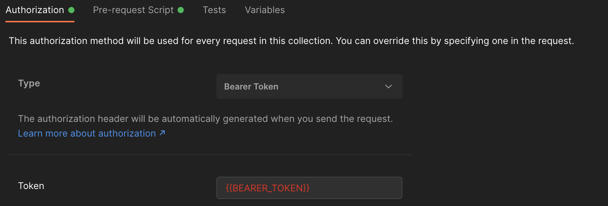

# Postman GCloud Token Setter

-----------------------

As a back-end developer I spend a lot of my time working with APIs from many different providers, either as for work or for hobby projects. To understand how these APIs work I tend to make use of Postman.

My recent development time has involved working with Google APIs. Google APIs require authentication which essentially boils down to you providing a bearer token. These bearer tokens are short lived and tend to require frequent regeneration. As you can imagine, this gets tedious fairly quickly when sending API requests to your endpoint.

To make my life slightly less cumbersome, I have decided to create this project.
  

# Pre-requisites

These applications and command line tools need to be installed.
| Tool | Version |
|--|--|
| NodeJS | >= 14 < 15 (required for development only)|
| Google Cloud CLI | latest (required for development only) |
| Docker | latest |
| Postman | latest |

# Set up the server

Step 1: Run this command to create the container called `gcloud-token` which will run on port `7778` and will be automatically restarted. *(Specifying the host explicitly will prevent anyone on your network from pulling your tokens.)*
```bash
docker run --name=gcloud-token --restart=always -p 127.0.0.1:7778:80 -d nalam/postman-gcloud-token
```

Step 2: Go inside the container so you can login to Google Cloud with your credentials.
```bash
docker exec -it gcloud-token /bin/bash
```

Step 3: Run the login command then follow the steps displayed on the console.
```bash
gcloud auth login
```

# Configuring Postman to use a pre-request script
## Configure as a global environment variable
1. Create a new collection e.g. `Token`


2. Add a new request to that collection.


3. Now set the url as `localhost:7778/token` and click the tab `Tests` to apply the script from below.

```javascript
pm.globals.set("BEARER_TOKEN", responseBody);
```
4. Click `Send` to populate the global `Bearer Token` and start using it from any requests that specifies `Authorization` Type as `Bearer Token` and `Token` as the global variable `{{BEARER_TOKEN}}`



## Configure as an environment variable
1. Create a new enviornment if you don't have one already.


2. Set the environment variable and a default initial value and save.


3. Select the environment you have just created from the top-right corner, and follow steps 1, 2 and 3 as above.
4. Instead of passing the globals in the `Tests` script, pass the snippet below:
```javascript
pm.environment.set("BEARER_TOKEN", responseBody);
```

5. Click `Send` to populate the `Bearer Token` and start using it for your environment from any requests that specifies `Authorization` Type as `Bearer Token` and `Token` as the environment variable `{{BEARER_TOKEN}}`


## Configure as per request variable
Create a new API Request in Postman, then select `Pre-request Script`. Copy and paste this snippet in the textbox. 

```javascript
pm.sendRequest('http://127.0.0.1:7778/token', (err, response) => {
    console.log(response.text());
    pm.variables.set("BEARER_TOKEN", response.text());
})
```


Finally, prepare the header to use bearer token by selecting the `Authorization` tab from the API Request tab in Postman, choose `Bearer Token` for Type and `{{BEARER_TOKEN}}` for Token.


